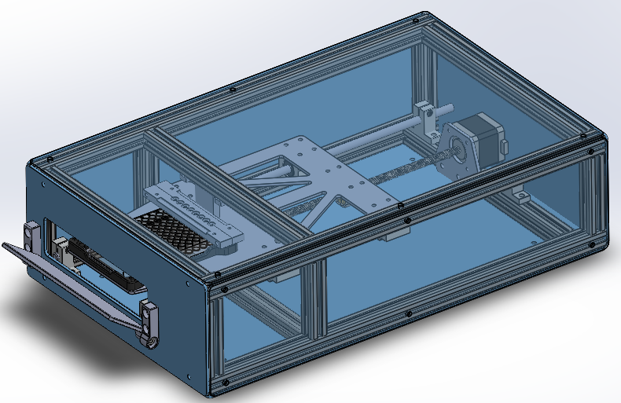

# Microplate-Reader

<!-- TODO: D&ID Poster -->

## Description

Microplate readers are laboratory instruments that are used to detect biological and chemical events
in samples plated in standard microtiter plates. They are widely used in research, bioassays, drug
discovery, and quality control in industry (pharmaceutical and biotechnology) and academic institutions
as well as in diagnostic services for health care.

This project is a UBC mechanical engineering capstone project, aiming to develop a low-cost (< CAD 1000), open-source single absorbance detection mode microplate reader, using 8 LED-photodiode pairs moving along 12 rows to cover a standard 96-well microplate.

## Documentation

The project consists of [mechanical](https://github.com/UBC-MECH2024-Capstone-Team14/Microplate-Reader-Mechanical), [hardware](https://github.com/UBC-MECH2024-Capstone-Team14/Microplate-Reader-Hardware), [firmware](https://github.com/UBC-MECH2024-Capstone-Team14/Microplate-Reader-Firmware) and [software](https://github.com/UBC-MECH2024-Capstone-Team14/Microplate-Reader-Software) subsystems. Please refer to the documentation in the respective repositories for more information.
