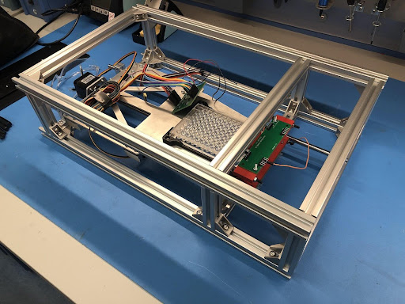
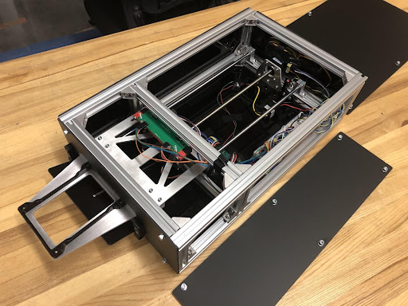
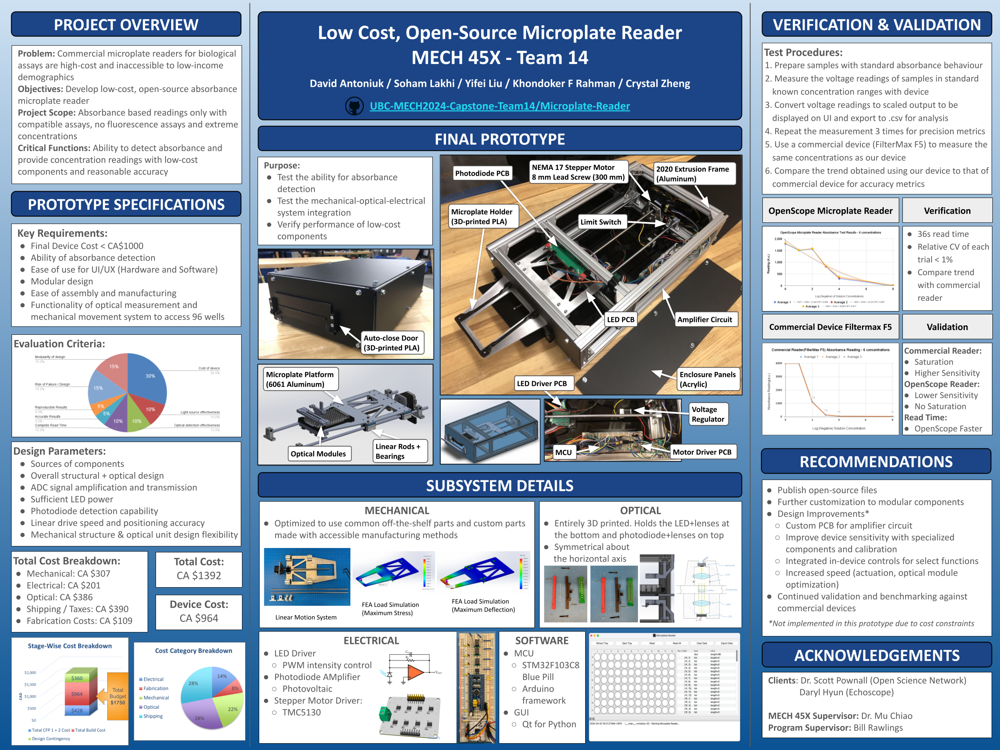

# Microplate-Reader

This project is a UBC mechanical engineering capstone project, aiming to develop a low-cost (< CAD 1000), open-source single absorbance detection mode microplate reader, using 8 LED-photodiode pairs moving along 12 rows to cover a standard 96-well microplate.

## Description

The objective was to develop a low-cost and open-source microplate reader, for use in clinical and biological settings with limited access to advanced technology. The project scope was to detect absorbance-based readings only with compatible assays, excluding fluorescence assays or extreme concentrations. The critical function was to detect absorbance and provide readings with low-cost components and reasonable accuracy and precision.

The primary requirements were to keep the total build cost below CAD $1000, design a modular system with minimal complexity for ease of further modification and customization, and achieve functional measurements with low-cost components. Our final design utilized a mix of commonly available off-the-shelf parts with custom parts that can be easily reproduced with 3D printing, or waterjet or laser cutting for 2D profiles. We developed custom PCBs for LED, LED drivers, and photodiode detectors, in addition to an amplifier circuit, programmed the MCU controller, and created a cross-platform GUI for user interaction with the device.

The final device produced a consistent output trend of absorbance readings across a standard concentration range of a standard dye. The precision was high with a variance lower than 1% and the calibration curves produced comparable correlation coefficients when using identical test samples.

## Documentation

The project consists of [mechanical](https://github.com/UBC-MECH2024-Capstone-Team14/Microplate-Reader-Mechanical), [hardware](https://github.com/UBC-MECH2024-Capstone-Team14/Microplate-Reader-Hardware), [firmware](https://github.com/UBC-MECH2024-Capstone-Team14/Microplate-Reader-Firmware) and [software](https://github.com/UBC-MECH2024-Capstone-Team14/Microplate-Reader-Software) subsystems. Please refer to the documentation in the respective repositories for more information.
